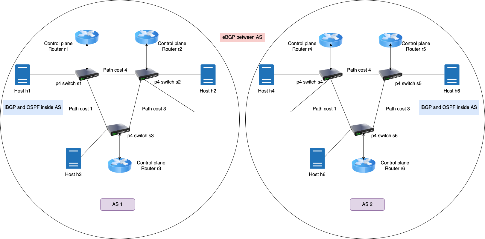

# Topology

## Introduction

Super-Node based topologies for testing our integrated control plane and data plane node. Current topology comprises of 2 Autonomous Systems (ASes), with the control plane routers 
spread across 2 AS, while the P4 switches are in the same logical network.

The control plane routers are in their own network namespaces, as are the hosts. The P4 switches are in the root namespace.

## What is running 

* OSPF within AS1 and AS2
* iBGP within AS1 and AS2
* eBGP accross AS1 and AS2

## Running the setup 

* `sudo p4run --config p4app.json` runs the topology, starts the switches and routers, and the FRR daemons on the control plane routers.
* We provide a a utility script `./launchfpm.sh,` which spawns tmux panes and runs instances of the controller for every control plane router.
* Custom packet sniffers for every interface can be run by `mx <node-name>`, followed by `python3 sniff_packets_received.py <node-name> <intf-name>`
* To send TCP packets for testing ECMP, run `mx <node-name>`, followed by `python3 send.py <host-ip> <number-of-packets>`
* To spawn a vty shell for FRR on the control plane router node, run `./access.sh <router-name>`

## Testing base router only topologies 

* We test every topology and router configuration on a simple router based topology, before we add our Super-Node for forwarding. The link to the same can be found here :
https://gitlab.ethz.ch/nsg/students/projects/2021/sa-2021-16_codesignplanes